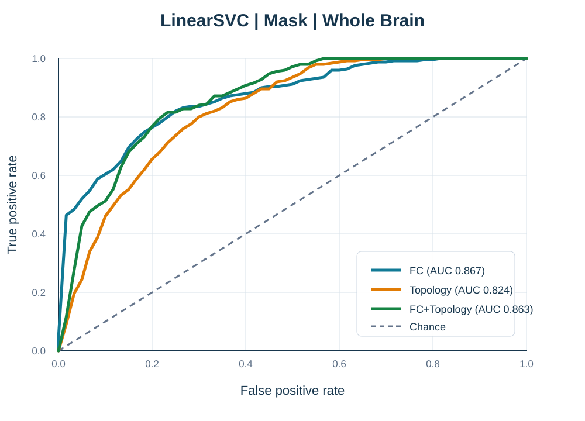

<div align="center">

# dNCR Classify

**基于术前功能脑网络与知识引导机器学习的术后延迟性神经认知恢复分类**

<a href="">论文</a> |
<a href="https://pan.baidu.com/s/1_I1wI9vkGXLGXeEK7EevDQ?pwd=yif2">数据</a> |
<a href="https://pan.baidu.com/s/1LX_xvaYv5Ulom7VZN107ig?pwd=i3i8">结果</a>

</div>

## 项目简介

本项目提供一套基于术前功能脑网络的术后延迟性神经认知恢复（delayed neurocognitive recovery，dNCR）分类与评估流程。项目比较四种脑网络（WB、DMN、SMN和VN）、三种特征模式（FC、Topology和FC+Topology）、两种特征版本（Original和Mask），以及五种分类模型（LinearSVC、LDA、Random Forest、Decision Tree和XGBoost）。

Mask方案将已有的神经影像学知识融入特征构建：WB和DMN保留拓扑先验，SMN加入NBS加权综合特征。拓扑先验从随数据提供的Mask工作簿中读取；每次划分中的缺失值填补、ANOVA-F特征排序、特征构建、标准化及各模型的特征数量K选择均只使用训练数据。所有模型和特征方案使用相同的50组固定分层患者划分进行评价。

## TODO

- [x] **2026-08-14** 开源训练与评估代码。
- [x] **2026-08-14** 开源处理后的实验数据。
- [x] **2026-08-14** 开源当前实验结果。
- [ ] 论文发表后补充论文链接和BibTeX引用信息。

## 数据与结果下载

请通过百度网盘手动下载以下压缩文件，并将其放在项目根目录。

| 文件 | 下载地址 | 提取码 | 内容 |
|---|---|---|---|
| `data.zip` | [百度网盘](https://pan.baidu.com/s/1_I1wI9vkGXLGXeEK7EevDQ?pwd=yif2) | `yif2` | FC矩阵、拓扑特征及Mask工作簿 |
| `results.zip` | [百度网盘](https://pan.baidu.com/s/1LX_xvaYv5Ulom7VZN107ig?pwd=i3i8) | `i3i8` | 当前预测结果、评价指标、图片和报告 |

下载完成后，在项目根目录解压：

```bash
unzip data.zip -d .
unzip results.zip -d .
```

解压后的项目目录应为：

```text
dNCR_classify/
├── configs/                 # 实验配置和固定患者划分
├── data/                    # 解压后的输入数据
├── docs/figures/            # README中展示的图片
├── model/                   # 特征构建、模型训练和结果汇总
├── results/                 # 解压或重新运行生成的结果
├── utils/                   # 数据读取、指标计算、绘图和PDF报告
├── environment.yml
├── run.sh
└── train.py
```

`results.zip` 用于在不重新运行完整实验的情况下查看论文相关结果；使用下载的 `data.zip` 重新训练时，不需要预先下载结果文件。

## 环境安装

推荐使用Conda创建独立运行环境：

```bash
conda env create -f environment.yml
conda activate dncr-classify
```

如果环境已经存在，而 `environment.yml` 发生了更新，可执行：

```bash
conda env update -f environment.yml --prune
```

## 运行代码

使用项目提供的Shell脚本运行完整实验：

```bash
bash run.sh
```

默认读取 `configs/experiment.yml`，并将全部输出保存到 `results/`。也可以通过第一个和第二个参数分别指定配置文件与结果目录：

```bash
bash run.sh path/to/experiment.yml path/to/results
```

也可以直接运行Python入口：

```bash
python train.py --config configs/experiment.yml --results results
```

完整实验将对五种分类模型、全部脑网络、三种特征模式、Original/Mask方案及50组外层患者划分进行评价。每个模型都在相应外层训练集中，通过3次重复分层10折交叉验证独立选择特征数量K，因此完整运行需要较长时间。

## 实验结果

### LinearSVC全脑ROC曲线

<div align="center">
  
</div>

上图展示LinearSVC在全脑Mask方案下，汇总50组测试集预测后得到的ROC曲线。FC、Topology和FC+Topology的汇总ROC-AUC分别为0.867、0.824和0.863。

### 全脑五种模型指标对比

下表统一比较 **WB + Mask + FC+Topology** 任务，所有指标均为50组测试集结果的均值 ± 样本标准差。

| 模型 | ROC-AUC | PR-AUC | 平衡准确率 | 敏感度 | 特异度 | 准确率 | F1 |
|---|---:|---:|---:|---:|---:|---:|---:|
| **LinearSVC** | **0.868 ± 0.049** | 0.660 ± 0.136 | **0.775 ± 0.048** | **0.828 ± 0.090** | 0.722 ± 0.071 | 0.742 ± 0.055 | **0.556 ± 0.060** |
| LDA | 0.847 ± 0.053 | 0.668 ± 0.111 | 0.663 ± 0.077 | 0.352 ± 0.159 | 0.973 ± 0.034 | 0.854 ± 0.036 | 0.466 ± 0.147 |
| Random Forest | 0.856 ± 0.054 | 0.669 ± 0.148 | 0.604 ± 0.082 | 0.228 ± 0.157 | 0.981 ± 0.037 | 0.836 ± 0.045 | 0.328 ± 0.215 |
| Decision Tree | 0.664 ± 0.096 | 0.400 ± 0.141 | 0.662 ± 0.096 | 0.396 ± 0.174 | 0.928 ± 0.068 | 0.825 ± 0.066 | 0.465 ± 0.177 |
| XGBoost | 0.799 ± 0.051 | **0.670 ± 0.080** | 0.681 ± 0.063 | 0.368 ± 0.124 | **0.994 ± 0.016** | **0.874 ± 0.028** | 0.519 ± 0.137 |

ROC图片采用50组测试预测汇总后计算的曲线，而表格中的ROC-AUC是先在每次划分中分别计算，再对50次结果求均值。因此，两者回答的统计问题不同，数值不要求完全一致。

## 可复现性设置

- 外层评价：50组固定分层患者划分，每组包含60例训练患者和26例测试患者。
- 特征排序：仅使用训练数据完成ANOVA-F排序。
- K值选择：在每个外层训练集中执行3次重复分层10折交叉验证。
- 随机种子：`13794`。
- 测试患者不参与每次划分中的缺失值填补、特征排序、标准化和K值选择；Mask先验从随数据提供的工作簿读取。

## 引用

论文发表后将在此补充论文链接和BibTeX引用信息。
